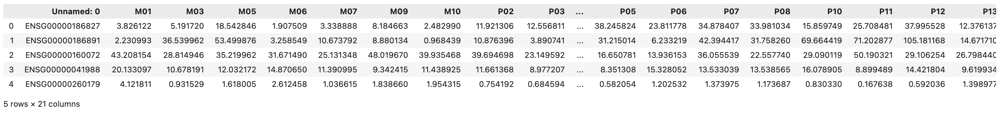

# Breast Cancer Gene Expression Analysis

A python-based bioinformatics and data science project analyzing gene expression patterns in primary and metastatic breast cancer.

## Project Goal

This project investigates whether gene expression patterns can distinguish primary breast tumors from metastatic tumors and explores which genes may contribute most strongly to those differences

## Technologies
- Python
- Jupyter Notebook / IPython

## Status 
In progress

## Dataset

The dataset used in this project is the **GSE191230** RNA-seq dataset from the NCBI Gene Expression Omnibus (GEO).

The study contains gene expression data from **20 breast cancer tumor samples**, including primary breast tumors and distant metastatic tumors.

The processed dataset contains TPM-normalized gene expression measurements, allowing gene expression levels to be compared across tumor samples.

- **M samples** represent metastatic tumors.
- **P samples** represent primary tumors.
- Each row represents a gene identified using an Ensembl gene ID.
- Each numerical value represents the expression level of that gene within a particular tumor sample.

### Understanding the Dataset

- **M samples (Metastatic tumors):** Samples taken from tumors that have spread from the original breast cancer site to another part of the body.

- **P samples (Primary tumors):** Samples taken from the original tumor located in the breast, before considering spread to distant parts of the body.

- **Ensembl Gene ID:** A standardized identifier assigned to a gene by the Ensembl genome database. For example, `ENSG00000186827` identifies a specific human gene.

- **Gene expression:** A measurement of how actively a gene is being used within a biological sample. In this dataset, higher values generally indicate higher measured expression of that gene.

- **TPM (Transcripts Per Million):** A normalization method used with RNA sequencing data that adjusts gene expression measurements so expression levels can be compared more meaningfully across samples.

Therefore, each **row** represents a gene, each **M or P column** represents a tumor sample, and each **numerical value** represents the TPM-normalized expression level of a particular gene within a particular tumor sample.

## Initial Data Exploration

The dataset was loaded and explored using Python and pandas.

The first inspection of the dataset shows that:

- Rows represent individual genes.
- The first column contains Ensembl gene identifiers.
- The remaining columns represent individual tumor samples.
- Gene expression values are represented using TPM (Transcripts Per Million) normalized measurements.

### Dataset Dimensions

Initial exploration of the processed gene expression dataset identified:

- **37,552 gene records** represented by Ensembl gene IDs
- **20 breast cancer tumor samples**
- **21 total columns**, consisting of one gene identifier column and 20 tumor sample columns

The dataset therefore contains gene expression measurements for thousands of gene records across each of the 20 tumor samples. Further exploration will determine whether all gene identifiers are unique and examine the distribution of primary and metastatic samples.

### Sample Composition

The dataset contains gene expression measurements from **20 breast cancer tumor samples**. Based on the sample identifiers, the dataset includes:

- **7 metastatic tumor samples:** `M01`, `M03`, `M05`, `M06`, `M07`, `M09`, `M10`
- **13 primary tumor samples:** `P02`, `P03`, `P04`, `P05`, `P06`, `P07`, `P08`, `P10`, `P11`, `P12`, `P13`, `P14`, `P15`

This means the two groups are **not equally represented** in the dataset, with more primary tumor samples than metastatic tumor samples. This imbalance will be considered later when performing statistical comparisons and evaluating machine learning models.

### Initial Data Quality Observations

An initial inspection of the dataset also revealed:

- All **20 tumor sample columns** contain numerical (`float64`) gene expression values.
- The gene identifier column contains text (`string`) values representing Ensembl gene IDs.
- All columns contain **37,552 non-null values**, indicating that no missing values were detected during the initial inspection.
- The gene identifier column is currently labeled `Unnamed: 0`. This will later be renamed to a more descriptive name during data cleaning.

These observations provide an initial understanding of the dataset's structure and will guide the data cleaning and preprocessing stages.

### Initial Sample Metadata Investigation

Before performing gene expression comparisons, individual GEO sample records were examined to understand the biological context associated with the expression measurements.

| Sample | Tumor Group | Source | Tissue Description | Cancer Type |
|--------|-------------|--------|--------------------|-------------|
| M01 | Metastatic | Lung | Breast cancer metastasis to lung | HER2+ breast cancer |
| P02 | Primary | Mammary | Primary tumor | HER2+ breast cancer |

These initial samples demonstrate why sample metadata is important. Both samples are classified as HER2+ breast cancer, but M01 represents breast cancer that metastasized to the lung, while P02 represents a primary tumor from mammary tissue.

The remaining sample metadata will be collected and structured programmatically before further analysis.

### Biological Context

To correctly interpret the gene expression data, it is important to understand the biological characteristics associated with each tumor sample.

#### Primary vs. Metastatic Tumors

A **primary tumor** is the original tumor that develops at the initial site of the cancer. In this dataset, primary samples represent tumors located in breast (mammary) tissue.

A **metastatic tumor** occurs when cancer cells from the original tumor spread to another part of the body and establish a tumor at a distant site. Although the new tumor may be located in another organ, it is still considered breast cancer because it originated from breast cancer cells.

For example, a breast cancer tumor that spreads to the lung is considered **metastatic breast cancer to the lung**, rather than lung cancer.

#### HER2+ Breast Cancer

**HER2 (Human Epidermal Growth Factor Receptor 2)** is a protein involved in regulating cell growth. HER2 is encoded by the `ERBB2` gene.

Some breast cancers contain increased HER2 signaling, commonly associated with amplification and/or overexpression of `ERBB2`. These cancers are classified as **HER2-positive (HER2+) breast cancers**.

HER2 status is important when interpreting this dataset because breast cancer subtype can influence gene expression. Therefore, differences observed between samples may be associated with factors such as tumor status, cancer subtype, or metastatic site rather than metastatic status alone.